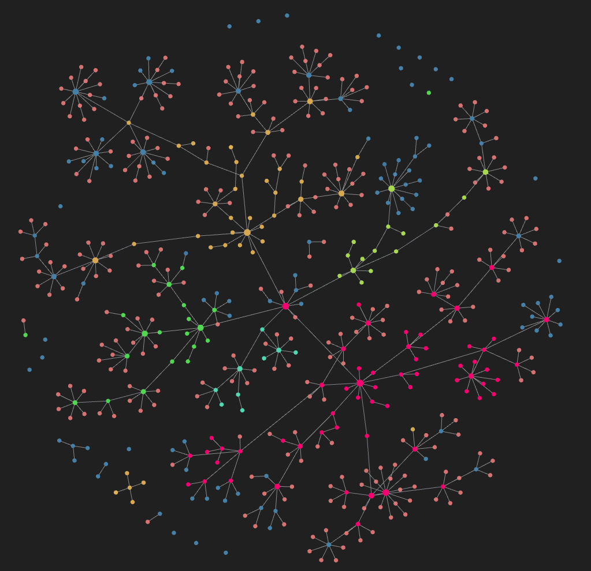

# 🔌 Proneta2Obsidian

> Convert Proneta XML network topology files into beautiful Obsidian Markdown documentation with automatic graph visualization

[](https://www.python.org/downloads/)
[](LICENSE)
[](https://github.com/psf/black)

## ✨ Features

- 📄 **Automatic Conversion**: Transform Proneta XML topology files into Obsidian-compatible Markdown
- 🔗 **Smart Linking**: Automatic bi-directional links between connected devices
- 🌐 **Network Graph Visualization**: Generated files create a beautiful interactive graph in Obsidian showing your entire network topology
- 🏷️ **Name Normalization**: Clean and standardize device names automatically
- 🔍 **Port Filtering**: Show only connected ports with meaningful data
- 🎯 **Intelligent Link Control**: Context-aware link rendering based on device types
- 🧹 **Clean Output**: Automatically removes old files before generating new ones

## 🚀 Quick Start

### Prerequisites

- Python 3.10 or higher
- Proneta XML export file

### Installation

1. Clone the repository:
```bash
git clone https://github.com/yourusername/proneta2obsidian.git
cd proneta2obsidian
```

2. No dependencies required! Uses only Python standard library.

### Usage

1. Place your Proneta XML file in the `resources` folder:
   ```
   resources/proneta.xml
   ```

2. Run the converter:
   ```bash
   python proneta2obsidian.py
   ```

3. Find your Markdown files in the `net` folder:
   ```
   net/
   ├── device1.md
   ├── device2.md
   └── ...
   ```

4. Import the `net` folder into your Obsidian vault!

5. Open Obsidian Graph View to see your **network topology visualized as an interactive graph** 🎨

## 🌐 Network Graph Visualization

The generated Markdown files use Obsidian's `[[wiki-links]]` to create automatic connections between devices. When you open **Graph View** in Obsidian, you'll see:

- 🔵 **Nodes**: Each device as a node
- 🔗 **Edges**: Physical connections between devices
- 🎨 **Visual Network Map**: Interactive topology you can explore
- 🔍 **Zoom & Filter**: Focus on specific network segments

**Graph View Benefits:**
- Instantly visualize network architecture
- Identify critical connection points
- Discover network paths and redundancy
- Track device relationships at a glance

## 📖 How It Works

### Input: Proneta XML
```xml
<Device>
  <NameOfStation>xd993cs100a01</NameOfStation>
  <IpAddress>192.168.1.10</IpAddress>
  <DeviceType>PLC</DeviceType>
  <PortList>
    <Port>
      <RemoteNameOfStation>xd2080sn500m</RemoteNameOfStation>
    </Port>
  </PortList>
</Device>
```

### Output: Obsidian Markdown
```markdown
# 993cs100a01

## Device Information
- **Name of Station**: 993cs100a01
- **IP Address**: 192.168.1.10
- **Device Type**: PLC

## Ports

### Port 1 (port-001)
- **Remote Station**: [[2080sn500m]]
```

## 🎨 Name Normalization

The script automatically cleans device names for better readability:

| Original Name | Cleaned Name |
|--------------|-------------|
| `xd993cs100a01.u21.062ae0` | `993cs100a01.u21.06` |
| `psu-5.xd993cs160u21.xd0253b0` | `psu-5.993cs160u21.02` |
| `xd1k1xbplcxb9107ae0` | `1k1plc910` |

**Rules:**
- Remove `xd` prefix when followed by digits → remove last 4 characters
- Replace `xb` with `_`
- Replace `xa` with space

## 🔗 Smart Link Rendering

The script intelligently handles links based on device types:

### Scenario 1: Regular Devices
✅ **Links enabled** - Normal bidirectional linking
```markdown
- **Remote Station**: [[target-device]]
```

### Scenario 2: Switch-Referenced Devices
❌ **Links disabled** - When a device is referenced by switches
```markdown
- **Remote Station**: target-device
```

### Scenario 3: Dual Switch Connection
⚠️ **SCALANCE links disabled** - When a device is connected to both:
- Unmanaged Switch
- SCALANCE device

Result: SCALANCE device shows plain text instead of links

## 📁 Project Structure

```
proneta2obsidian/
├── proneta2obsidian.py    # Main conversion script
├── resources/             # Input XML files (ignored by git)
│   └── proneta.xml
├── net/                   # Output Markdown files (ignored by git)
│   ├── device1.md
│   └── ...
├── pyproject.toml         # Project configuration
├── uv.lock               # Dependency lock file
├── .gitignore
└── README.md
```

## ⚙️ Configuration

### XML File Location

The script looks for XML files in this order:
1. `./sources/proneta.xml` (full version)
2. `./resources/proneta.xml` (fallback)

### Output Directory

By default, Markdown files are generated in `./net/`

### Empty Device Names

If a device has no `NameOfStation`, the script generates one:
```
{DeviceType}_{IpAddress}
```
Example: `SCALANCE_X-500_10.25.2.154`

## 🛠️ Development

### Project Setup with UV

```bash
# Using UV package manager
uv run proneta2obsidian.py
```

### Or with Python directly

```bash
python proneta2obsidian.py
```

## 📋 Requirements

- Python 3.10+
- No external dependencies (uses standard library only)
  - `xml.etree.ElementTree`
  - `pathlib`
  - `re`
  - `os`

## 🤝 Contributing

Contributions are welcome! Feel free to:

1. Fork the repository
2. Create a feature branch (`git checkout -b feature/amazing-feature`)
3. Commit your changes (`git commit -m 'Add amazing feature'`)
4. Push to the branch (`git push origin feature/amazing-feature`)
5. Open a Pull Request

## 📝 License

This project is licensed under the MIT License - see the [LICENSE](LICENSE) file for details.

## 🎯 Use Cases

- **Network Graph Visualization**: Build beautiful, interactive network topology graphs in Obsidian
- **Industrial Network Documentation**: Document complex PROFINET/Industrial Ethernet topologies
- **Knowledge Management**: Integrate network diagrams into your Obsidian vault
- **Network Analysis**: Visualize device connections and relationships
- **Change Tracking**: Keep historical records of network configurations
- **Topology Exploration**: Use Obsidian's graph view to explore network structure interactively

## 💡 Tips

1. **Obsidian Graph View**: Open Graph View (Ctrl/Cmd + G) to see your **complete network topology** as an interactive graph
2. **Graph Filters**: Use Obsidian's graph filters to focus on specific device types or network segments
3. **Local Graph**: Right-click any device to see its immediate connections in Local Graph view
4. **Tags**: Add custom tags in the generated Markdown for better organization and graph filtering
5. **Dataview Queries**: Use Obsidian's Dataview plugin for advanced network queries
6. **Version Control**: Keep your Markdown files in git for change tracking
7. **Canvas View**: Create custom network diagrams using Obsidian Canvas with your device files

## 🐛 Known Limitations

- Only processes devices in `<DeviceCollection>`
- Requires `RemoteNameOfStation` for port connections
- Link rendering rules are optimized for PROFINET/SCALANCE topologies

## 📞 Support

If you encounter any issues or have questions:

- Open an [Issue](https://github.com/yourusername/proneta2obsidian/issues)
- Check existing issues for solutions
- Provide sample XML (anonymized) for debugging

---

**Made with ❤️ for network engineers using Obsidian**